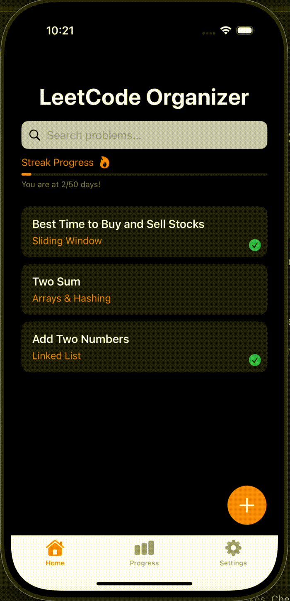

# LeetCode Organizer

**LeetCode Organizer** is a SwiftUI iOS app that helps users track and manage their LeetCode practice. With features like custom tagging, streak progress tracking, multiple solution storage (with screenshots and notes), and a sleek dark-themed interface, this app makes technical interview prep more structured and visually rewarding.

The app supports sorting, searching, and progress visualization across 18 NeetCode topics, along with daily reminder notifications to help users stay consistent. All data is stored locally, with options to import/export problems as JSON for easy backup.

### 🔧 Built With
- **SwiftUI** – Declarative UI framework for building modern iOS apps  
- **Combine** – For reactive state updates with `@Published` and `@ObservedObject`  
- **UserNotifications** – For local daily reminders  
- **FileManager** & `@AppStorage` – For persistent local storage of problems and settings  
- **MVVM Architecture** – Clean separation of views and logic using ViewModels  

## ✅ User Stories

The following **required** functionality is completed:

- [x] User can **add a new LeetCode problem** using a `+` button with a styled input form  
- [x] User can **assign topics** (tags) to problems using a dropdown menu  
- [x] User can **search problems** with a responsive search bar  
- [x] User can **mark problems as completed**, which updates progress  
- [x] User sees a **"Streak Progress" bar** that updates at milestone thresholds (50, 100, 250...)  
- [x] Streak progress visually includes **🔥 fire icons** that increase with progress  
- [x] User can **view, edit, or delete** any problem by tapping it  
- [x] All data is **persisted locally** using `@AppStorage` or file system

---

The following **optional** features are implemented:

- [x] User can **upload solution screenshots** from the image library for each problem  
- [x] User can **add multiple solutions** per problem, each with notes and time/space complexity dropdowns  
- [x] App features a **tab-based navigation bar** with Home / Progress / Settings  
- [x] The **Progress tab** shows all 18 NeetCode topics with orange progress bars  
- [x] User can **export or import** their saved problems via JSON  
- [x] A **reminder notification** can be scheduled (e.g. daily at 9 AM)  
- [x] User can **customize reminder frequency** (Daily, Every 3 Days, Weekly, Off)  
- [x] User can **choose sort order** (By Time Added, Alphabetical, By Completed)

---

The following **additional** features are implemented:

- [x] Dark theme UI with custom colors matching LeetCode's aesthetic  
- [x] Stylish card layout for problems, using bold fonts and accent colors  
- [x] Custom emoji indicators (🔥, ✅) used for engaging visual feedback  
- [x] Toolbar icons and layout spacing adjusted for consistency across devices  
- [x] App uses `@ObservedObject` and MVVM pattern for clean architecture

## 📱 App Demo

---

## 🔐 Privacy Policy

**LeetCode Organizer** does **not** collect or transmit any personal information or user data.

- All app data (including problems, tags, solutions, screenshots, and settings) is stored **locally** on your device.
- No data is transmitted to external servers or third-party services.
- Notification permissions are used **only** for scheduling local reminders on your device.
- The app does **not** use analytics, advertising, or tracking of any kind.

If you have any questions about this policy or encounter privacy concerns, feel free to reach out via GitHub.

---
